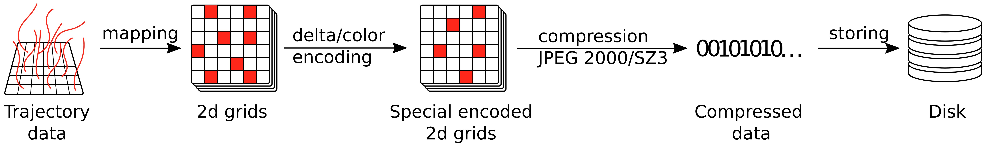

# psit - A system to compress lagrangian flows

Psit is a compression pipeline designed to compress lagrangian flow fields. It can be used to compress such trajectory data from the command line using netCDF files or from a scripting environment..

The compression pipeline works by first mapping the trajectories onto continuous 2d grids, then encoding these grids using delta and/or color encoding after which they get compressed by either `JPEG 2000` or `SZ3` (depending on the users choice) and saved to disk.



## Requirements on input data

The trajectory data must have three positional data variables longitude, latitude and pressure which are called `lon`, `lat` and `p`. These must be two dimensional with the first dimension being time and the second one going over the trajectories, note that it is allowed to have additional dimensions if they have size one. In addition to these positional variables the dataset can have other data defined on the trajectories, like temperature. These additional data variables must have same dimension as the positional ones. 

At the first time step the trajectories can either be distributed on distinct pressure levels or randomly (check `bin` parameter), but for each of those pressure levels (or binned pressure levels when using `bin`) the trajectories must be evenly distributed over the globe.

If there are data variables present in the dataset which should not be compressed they can be excluded using the `exclude` list.

# Installation

## docker
If only the cli interface of psit will the be used the recommended way of installation is via a docker. For this the `dockerfile` file is provided, the installation then becomes:
```
docker build -t psit .
```
This will create a container called psit which can then be used.


## Manual installation

If also the scripting interface of psit will be used, or no docker is available, psit can be installed manually. For this a c/c++ compiler, cmake, python (with version >= 3.11 tested, >= 3.10 might work), and git is needed.

In a first step SZ3 needs to be installed and compiled, the installation directory of the files need to be `<location_of_psit.py>/SZ3/install/lib64`. In order to achieve this the following commands can be used:
```
git clone "https://github.com/szcompressor/SZ3.git" ./SZ3
cd SZ3
mkdir build && mkdir install
cd build
cmake -DCMAKE_INSTALL_PREFIX:PATH=./../install ..
make && make install
```
This will download SZ3 create a build and install folder, build SZ3 and put the corresponding libraries into the install folder.

Next the required python packages need to be installed, we recommend to use a virtual python environment. All the required packages are present in `requirements.txt` and can be installed using e.g. pip with:
```
pip install -r requirements.txt
```

If one wants to use the mapping function based on linear programming then the `find_idx.cpp` file needs to be compiled into the `find_idx.so` library, this can be done with:
```
g++ -shared -o find_idx.so -fPIC find_idx.cpp
```


# Usage guide

When using the LP mapping method a valid Gurobi license needs to be available. When using the container environment the location of this license file needs to be mapped to the `/root` folder in the container. 

Psit can be used from a scripting environment or the command line.

## Scripting environment
To use the scripting environment the `psit.py` file needs to be imported which will expose the `Psit` class. This class has two functions `compress()` and `decompress()` which can be used to compress and decompress files.

### Compression
The signature of `compress()` is:
```python
compress(dataset: xr.Dataset, filename: str, crf: int|dict, exclude: list = [], method: str|dict = "jpeg", color_method: str = "xyz", color_bits: int = 16, delta_method: str|dict = "r1", bin: int = 0, mapping_func: str = "bipar", num_workers: int = 1, factor: float = 1.5)
```
#### Parameters

`dataset`:\
An xarray Dataset containing all of the information.

`filename`:\
The filename to which one wants to write the data.

`crf`:\
Compression factor, i.e. the amount of compression that is desired. Either a single integer or a dictionary from data variable name to integers depending on if one wants to have different compression amount per data variable.

`exclude`: default `[]`\
List with all the data variable names which should not be compressed. E.g. 'BASEDATE'.

`method`: default `"jpeg"`\
The method used for the compression, avaiable methods are "numpy", "numpy16bit", "numpy8bit", "jpeg", "sz3". This is either a single string or a from data variable names to strings depending on if one wants to define a compression method per data variable or one for all.

`color_method`: default `"xyz"`\
The color method to be used for compression of the longitude data variable. Can be "none", "circle", "luigi", "hsv".

`color_bits`: default `16`\
The amount of bits to use for each color channel when using colour compression. Either 8 or 16.

`delta_method`: default `"r1"`\
The delta encoding method to use, valid methods are "none", "n1", "r1". "n1" is the method which operates on the perfect grids, while "r1" uses the reconstructed ones. Can either be a string or a dictionary from data variables to strings depending on if one wants to set a delta method for each data variable individually or for all them at the same time.

`bin`: default `0`\
Can be used to control the number of pressure levels the trajectories should be binned into in the first time step, if no binning is required set this to 0.

`mapping_func`: default `"bipar"`\
A string telling which mapping method to take, either "bipar" or "lp", always choose "bipar".

`num_workers`: default `0`\
Number of parallel workers, should be between 1 and number of levels.

`factor`: default `1.5`
The ratio between number of pixels and number of trajectories. factor=1.5 means that we have 1.5 times more pixels than trajectories.

#### Returns
The function creates a file called `<filename>.zip` in which the compressed data is stored.


### Decompression
The decompress function has a simpler signature:
```python
decompress(filename: str)
```

#### Parameters

`filename`:\
The filename of the compressed data file

#### Returns
Returns an `xarray.Dataset` which contains the decompressed data.

### Example

```python
from psit import Psit
import xarray as xr

psit = Psit()
psit.compress(xr.open_dataset("tra_small.4"),"compressed.zip", 10, ["BASEDATE"], num_workers=26)
decom = psit.decompress("compressed.zip")
decom.to_netcdf("decompressed.nc")
```


# CLI
## Manual installation
To use the cli interface run
```
python psitcli.py {compress/decompress/test} [options] in_file out_file
```
the first argument is the mode to be used, compress compresses a netCDF file, decompress decompresses a compressed file back to a netCDf one, and test performs a compression followed by a decompression and prints compression performance characteristics, it additionally creates a pickle dump with all the compression characteristics. This dump can be rather large, but as it is not part of the compressed file it can be deleted without problem.

The different available options can be seen with the 
```
python psitcli.py {compress/decompress/test} -h
```
command.

## Docker 

The usage of the docker is the same as the one used for manual installation, with the only exception that instead of calling `python psitcli.py ...` one executes the container:
```
docker run psit {compress/decompress/test} [options] in_file out_file
```

